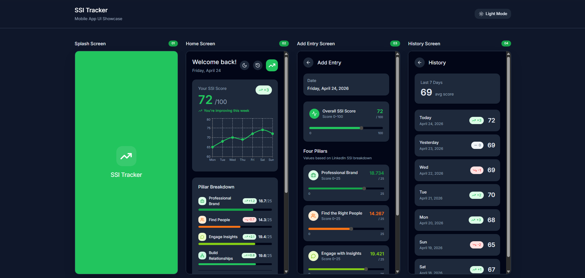
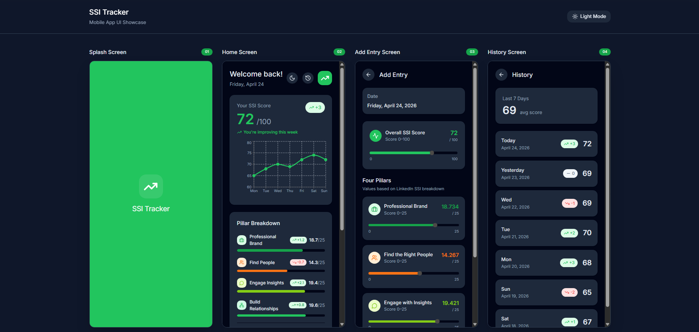

# SSI Tracker 📈

**SSI Tracker** é um aplicativo Android moderno desenvolvido para ajudar profissionais a monitorarem
e melhorarem seu **LinkedIn Social Selling Index (SSI)**. O app permite registrar suas pontuações
diárias, visualizar a evolução através de gráficos e receber dicas personalizadas geradas por IA.

## 📱 Preview

<div align="center">
  
  
</div>

## 🚀 Funcionalidades

- **Dashboard Principal**: Visualize sua pontuação atual, o gráfico de evolução da última semana e
  sua sequência (streak) de registros.
- **Registro de Pontuação**: Adicione facilmente sua pontuação total e o detalhamento dos 4 pilares
  do SSI.
- **Histórico Completo**: Lista detalhada de todos os registros passados com cálculo de média.
- **Dicas Diárias com IA**: Receba sugestões personalizadas para melhorar seu SSI, geradas via *
  *Google Gemini AI**.
- **Gráficos Dinâmicos**: Gráfico de linha customizado para visualizar o progresso.
- **Modo Escuro**: Suporte completo a tema claro e escuro.

## 🛠 Tecnologias e Arquitetura

O projeto utiliza as melhores práticas de desenvolvimento Android moderno:

- **Linguagem**: [Kotlin](https://kotlinlang.org/)
- **UI Framework**: [Jetpack Compose](https://developer.android.com/jetpack/compose)
- **Arquitetura**: MVVM (Model-View-ViewModel) + Clean Architecture.
- **Injeção de Dependência**: [Koin](https://insert-koin.io/)
- **Banco de Dados**: [Room](https://developer.android.com/training/data-storage/room).
- **IA**: Google Generative AI SDK (Gemini).
- **Persistência**: DataStore.

## 📦 Estrutura do Projeto

```text
app/src/main/java/com/ssitracker/app/
├── data/           # Implementações de Repositories, DAO, Entidades e Mappers
├── domain/         # Modelos de negócio, Interfaces de Repositories e Use Cases
├── ui/             # Componentes de UI, Screens, ViewModels e Temas
└── di/             # Módulos de Injeção de Dependência
```

## ⚙️ Como rodar o projeto

1. Clone o repositório.
2. Certifique-se de ter o **Android Studio Ladybug** ou superior instalado.
3. Obtenha uma API Key do Gemini no [Google AI Studio](https://aistudio.google.com/).
4. Adicione sua chave no arquivo de configuração apropriado.
5. Sincronize o Gradle e execute no seu dispositivo ou emulador.

## 📝 Licença

Este projeto está sob a licença MIT.

---
Desenvolvido por [Vítor Cavalcante Souza](https://github.com/Vitor-C-Souza)
